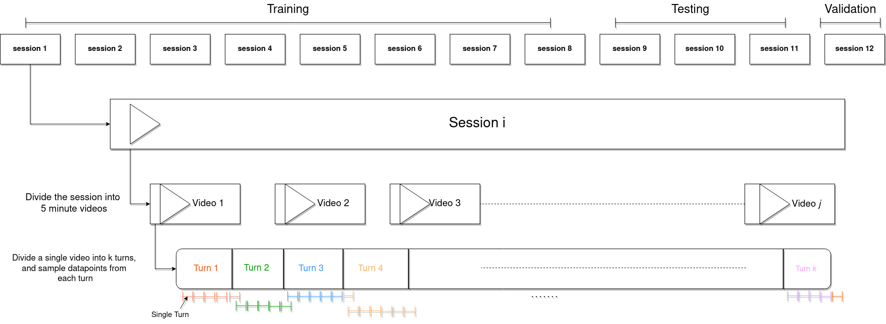

# Conversational-Role-Detection

This is the repository for the paper titled 
>Is it possible to recognize speaker without listening?

## Link to paper
    [paper](https://eliird.lol)
    -TODO Add the link to the paper

## Abstract
This study investigates the feasibility of understanding conversation dynamics in multi-party interactions without relying on auditory cues, focusing on continuous eye gaze as a key non-verbal communication modality. Without converting gaze into binary features, the study aims to explore the richness of continuous eye gaze information to discern diverse conversation dynamics. We employ eye gaze data from a video dataset featuring interactions among three individuals to identify distinct roles they take during a conversation, including the speaker, main listener (or addressee), and sub-listener (or side-participant). We constructed a system that utilizes continuous gaze from the three individuals for detecting roles taken by them throughout the conversations, and investigated various model configurations.Our findings demonstrate promising results, showing accuracy of 81.5% for the best model with an input window length of 2 seconds, in detecting conversation dynamics using eye gaze only. This study contributes valuable insights into the need of studying non-verbal communication cues in a continuous fashion, offering practical implications for diverse fields, including human-computer interaction and social robotics.


This repository includes the code and dataset for the `Role Detection System`. For `Gaze Detection System` which was used to preprocess the videos to generate gaze vectors checkout [Gaze Detection](https://github.com/eliird/GazeDetectionSim)

# Dataset
This section explains the preprocessed dataset used for the role detection system

## Preprocessed Data

Download the dataset from the link below and put it in the main folder as `./df_updated.pth.tar`\ to use with code from this repository
[dataset](https://drive.google.com/file/d/19RrXM1tdD5bJRaBw46Ekr5jRyh3I2c1m/view?usp=drive_link)

The dataset was recorded for conversation between 3 people always sitting in the orientation shown in the image below.

The downloaded file is a python pickle object. Reading the file gives you a datframe with the following columns

```
ti - start time of the turn
tf - end time of the turn
c01_role - role of the person sitting in c01 position 

```




# Installation

## Dependencies
python=3.11\
`pip install -r requirements.txt`

## Reproducing
`build_and_run.py dc 0 f_xf dc` will run 10-folds cross validation for the GAU model for continuous data.\
Keeping the first three args unchanged, change the last two arguments to switch to other models and data modes.
- 4th arg
    - f_xf: proposed GAU-based model
    - ann_d_512: MLP with 512 hidden dimension 
    - ann_d_1024: MLP with 1024 hidden dimension 
    - lstm_l_1: LSTM with 1 layer
    - lstm_l_2: LSTM with 2 layers
    - lstm_l_3: LSTM with 3 layers
    - cnn: CNN model
- 5th arg
    - dc: continuous gaze input
    - dd: discrete gaze input
    - siso: input only contains the gaze of the target individual
    - diso: input contains gazes other than the target individual
    - tiso: input contains gazes for all individuals

`bash run.sh` will do cross validation for all models.
Results will save to `./cross_val_results/`.\
`result.ipynb` can be used to check the results.
